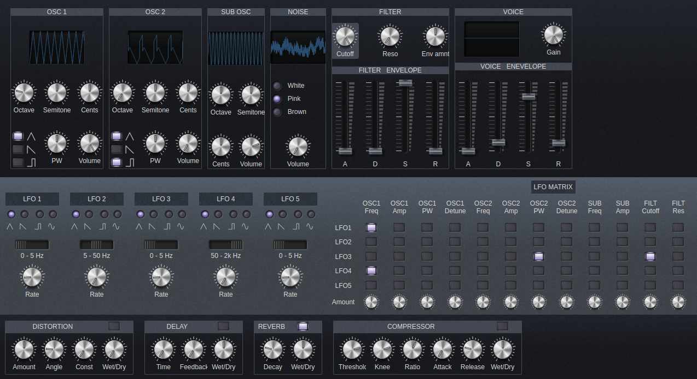

# Vintage analog web synth

#### Online Demo: [netlify-page](https://vintage-analog-web-synth.netlify.app/) hosted for free on Netlify
#### Description:
This is a TypeScript, Svelte and Web Audio API virtual analog subtractive synthesizer.

This synthesizer has the folowing features:
* 2 general purpose oscillators (triangle, sawtooth, pulse), inspired be the Sequential Prophet
* a noise oscillator (white, pink or brown noise)
* a sine sub-oscillator, that overpasses the filter
* a low pass filter with cutoff frequency and resonance
* one ADSR envelope for the volume/amplitude
* another ADSR envelope for filter cutoff frequency (works, but change is not very noticeable, still needs tweeking)
* 5 LFOs which can be mixed together in the "LFO Matrix", with 4 shapes, 3 frequency ranges (0 - 5 Hz, 5 - 50 Hz, 50 - 2000 Hz)
* effects: distortion, delay, reverb, compressor
* currently only monophonic, polyphony will be added soon

### License
The source code is licensed under the MIT license.

The images that I made myself are licensed under Creative Commons CC0.

The rest of the images/fonts are free images from the internet and they have their own license. 